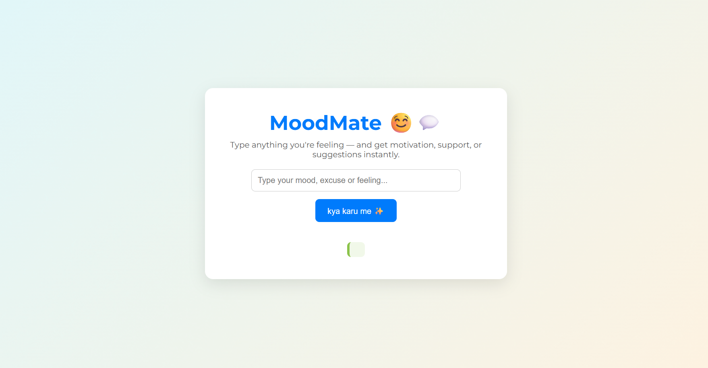

# 🌟 MoodMate — No More Excuses, Just Encouragement! 💬

> _“Start where you are. Use what you have. Do what you can.” – Arthur Ashe_

MoodMate is your personal motivation buddy — designed to help you overcome excuses, uplift your mood, and take small, empowering steps. Whether you're feeling tired, stuck, sad, or even too excited to concentrate, MoodMate has a message just for you. ✨

---

## 💡 What Is MoodMate?

**MoodMate** is a simple, elegant web app that responds to your current mood or excuse with:

- Motivational messages 🧠
- Uplifting quotes 📝
- Positive action suggestions 🎯

It’s like a pocket-sized pep talk, ready anytime you need a push!

---

## 🚀 Features

✅ Recognizes common moods and excuses  
✅ Generates motivating, feel-good responses  
✅ Includes inspiring quotes with every interaction  
✅ Minimal and clean UI with soft visuals  
✅ Suggests tiny actions to boost productivity or joy  

---

## 🎯 How to Use
1. Clone this repository **or** [open the live site](https://akshitomar.github.io/MoodMate/)  
2. If cloned, open `index.html` in your browser  
3. Type your mood, excuse, or feeling (e.g. “I’m tired”, “happy”, “bored”)  
4. Click **"Motivate Me ✨"**  
5. Receive a powerful response, quote, and idea to take action 💬💪

---

## 🛠️ Tech Stack

- 🧾 HTML
- 🎨 CSS (custom + Google Fonts)
- ⚙️ JavaScript

---

## 📸 Preview

  
*Simple. Friendly. Effective.*

---

## 🌱 Future Enhancements

- 🎤 Voice input for moods
- 📅 Daily motivational streaks
- 🌓 Dark / Light mode toggle
- 🧠 AI-powered mood detection
- 📓 Mood journal with history

---

## 💖 Inspiration

Built from real-life moments when motivation was hard to find and a reminder that **you are more capable than you think.**

---

## 👩‍💻 Created By

**Akshi Tomar**  
[GitHub](https://github.com/AKSHITOMAR) 
_“I’m not perfect — just persistent enough to keep going.” 🚶‍♀️💻_

---

## 📢 Spread the Word

If you liked this project, don’t forget to ⭐ star it and share it with someone who needs a little motivation today!

---

